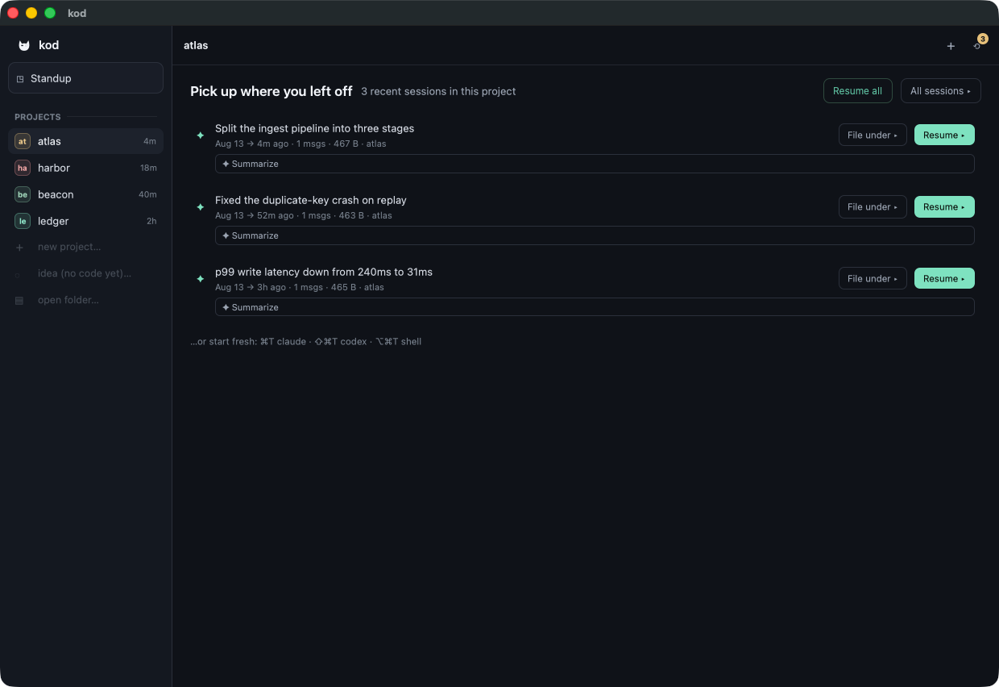
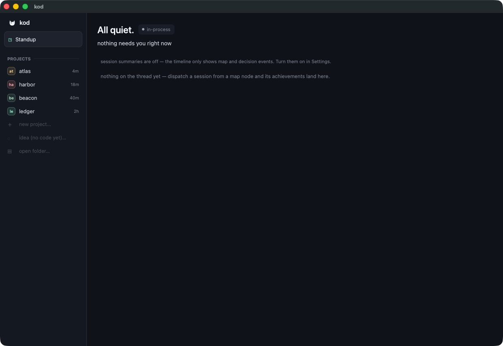

# Kod

**Run a fleet of AI coding agents without frying your brain.**

Ten `claude` / `codex` sessions across your projects, and you're tab-hopping just
to find which one finished or needs you. Kod is the macOS command center that
watches them all and shows you, at a glance, **who needs you** and what each got done.

> Named after the **kodkod** (*Leopardus guigna*), the smallest wild cat in the
> Americas — from **FelisAI**. Small, quiet, always watching.

Built in Rust on [GPUI](https://github.com/zed-industries/zed).

<p align="center">
  
</p>

---

## What it does

- **Standup** — a reactive home across every project: who's **live**, **idle**,
  **needs-you** (a decision is waiting), or **blocked** (hit a usage limit), plus
  idle-time **LLM summaries** of what each session got done. A **desktop
  notification** fires the moment a session needs you — so you can look away and
  trust Kod to pull you back.
- **Sessions as the workspace** — the focused agent's terminal/stream is the main
  stage, not a drawer. Spawn `claude`, `codex`, or a shell into any project.
- **Profiles** — named per-CLI **accounts** (isolated by `CLAUDE_CONFIG_DIR` /
  `CODEX_HOME`), so you can run two `claude` accounts (or two `codex`) and pick one
  when you start a session. Resume re-adopts the account the session was born under.
- **Recover** — find, import, and resume crashed or previously-run sessions.
- **Projects** — a default projects folder, one directory per new project, and
  "Open folder…" to adopt any existing repo in place.
- **Owned sessions** — a background daemon owns your sessions with full fidelity,
  surviving GUI restarts.

<p align="center">
  
</p>

## Requirements

- **macOS 13 or newer.**
- **A Rust toolchain via [`rustup`](https://rustup.rs).** The repo pins a nightly
  in `app/rust-toolchain.toml`; `rustup` reads that file and installs the pinned
  toolchain for you on first build — you don't pick a version.
- **The Xcode Command Line Tools** — `xcode-select --install` — for the C compiler
  and linker. Kod compiles native code (SQLite via `rusqlite`'s `bundled` feature,
  plus the alacritty terminal core), so a working C toolchain is required.
- **The agent CLIs you want to drive** — [`claude`](https://claude.com/claude-code)
  and/or `codex` — installed and on your `PATH`. Kod orchestrates these; without at
  least one it has little to do.

> **The first build takes several minutes.** `rustup` downloads the pinned nightly
> toolchain, then the first `cargo build` compiles the whole dependency tree from
> source — including the native deps (bundled SQLite, the alacritty terminal core).
> Later builds are incremental and fast.

## Build & run

There's no signed or notarized binary yet — installing Kod means building it from
source. The Cargo workspace lives under `app/`.

```sh
cd app

# run it directly
cargo run -p orchestrator-gui

# …or assemble Kod.app and launch from the dock
sh scripts/make-app.sh          # debug build
open ../Kod.app
```

> **On the name.** Kod was built under the internal name `orchestrator`, and the
> crates (`orchestrator-gui`, `orchestrator-daemon`, …), the binary, and the data
> directory (`~/Library/Application Support/orchestrator/`) still use it. Renaming
> them would move every existing user's data, so they keep it. Kod is the product;
> `orchestrator` is the plumbing.

## What Kod runs on your machine

Kod is a local orchestrator, not a hosted service. It spawns shells and the
`claude` / `codex` CLIs as child processes on your Mac, and injects each profile's
account environment (`CLAUDE_CONFIG_DIR` / `CODEX_HOME`) into the sessions it
starts. Any LLM calls run under **your** account and spend **your** tokens — in a
default build that's only Standup's session summaries, since Map and Memory are off.

## Coming next

Two bigger subsystems are in progress. They're **off by default** — both are
mid-iteration and spend LLM tokens, so the default build stays quiet and cheap —
but you can preview them behind a flag:

- **Project map** (`map`) — a GUI for steering a *project*, not just its sessions.
  See your roadmap, todos, and how the pieces fit on one canvas, and **offload the
  plan from your head onto a map that stays in sync** as the work moves — the same
  "reduce your mental overhead" idea, one level up from sessions.
- **Memory** (`memory`) — the memory system that **backs the map**: purpose-built
  for how Kod actually works, not a generic bolt-on. Still taking shape — more as
  it lands.

Preview them while they bake:

```sh
cargo run -p orchestrator-gui --features map,memory
```

Everything else — Standup, sessions, profiles, recover — is always on, and the
only background LLM a default build uses is Standup's session summaries.

## Configuration

- **In-app models** — the background summarizer's model is your account's default;
  override per-lane in **Settings → In-app LLM**, or via `ORCH_PROMPT_PLUMBING_MODEL`
  / `ORCH_PROMPT_STRUCTURAL_MODEL`.
- **Projects folder** — set in **Settings → General** (defaults sensibly under your
  home).

## Contributing

See [`CONTRIBUTING.md`](CONTRIBUTING.md) for how to build, test, and send a pull
request. One thing worth knowing before you open the source: comments cite
internal design documents (`docs/NNN`) that aren't published with the code, and
the code is written to be read without them.

## License

[Apache-2.0](LICENSE). See [`NOTICE`](NOTICE) for third-party attributions.
